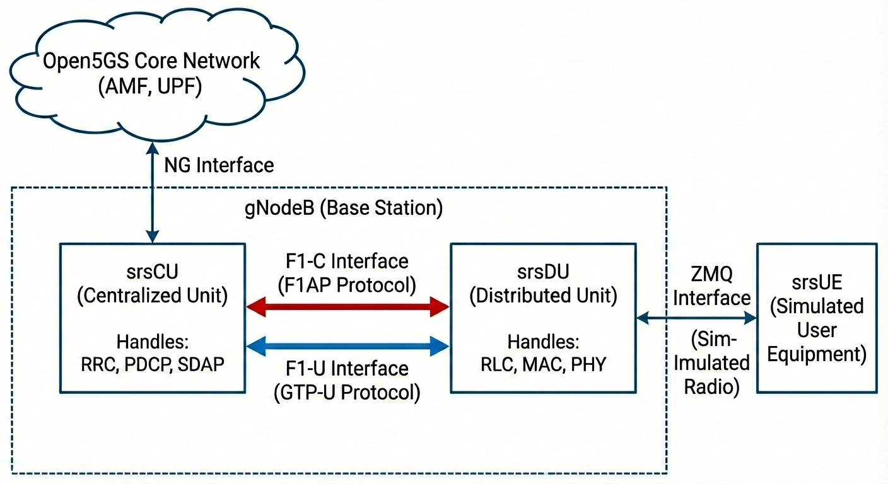

# srsRAN F1AP CU–DU Split

**End-to-End 5G Deployment using Open5GS + srsRAN (CU/DU Split) + srsUE**




---

## Overview

This repository documents a complete **srsRAN F1AP CU–DU split deployment** using a **virtual RF setup (ZeroMQ)**.
The deployment follows a **3GPP-aligned CU/DU architecture** and is suitable for **learning, experimentation, and research**.

### Key Components

* **Open5GS** – 5G Core Network (Docker-based)
* **srsRAN Project** – 5G gNB split into:

  * **CU (CU-CP + CU-UP)**
  * **DU**
* **srsRAN 4G (srsUE)** – UE implementation
* **ZeroMQ** – Virtual RF interface (no SDR required)

---

## High-Level Architecture

```
                 +-----------------------------+
                 |           VM 1              |
                 |                             |
                 |  Open5GS 5GC (Docker)       |
                 |            +                |
                 |  srsRAN CU (CU-CP + CU-UP)  |
                 +-------------+---------------+
                               |
                           F1AP / F1U
                               |
                 +-------------v---------------+
                 |           VM 2              |
                 |                             |
                 |  srsRAN DU                  |
                 |        +                    |
                 |  srsUE (ZMQ, netns)         |
                 +-----------------------------+
```

---

## Reference Documentation

* **srsRAN CU–DU Split (Official Docs)**
  [https://docs.srsran.com/projects/project/en/latest/tutorials/source/cu_du_split/source/index.html#o-ran-cu-du-split](https://docs.srsran.com/projects/project/en/latest/tutorials/source/cu_du_split/source/index.html#o-ran-cu-du-split)

---

## System Requirements

### Hardware

| Resource | Recommendation |
| -------- | -------------- |
| CPU      | 8 cores        |
| RAM      | 12 GB          |
| Disk     | 40+ GB         |

### Operating System

* Ubuntu **22.04.1 LTS**

### Deployment Model

* **VM 1** → Open5GS Core + srsCU
* **VM 2** → srsDU + srsUE
---

## Software Components

* Open5GS (Docker-based)
* srsRAN Project (latest)
* srsRAN 4G **v23.11 or later**
* ZeroMQ

---

## Prerequisites (VM1 & VM2)

Install the following packages **on both VMs**:

```bash
sudo apt update
sudo apt install -y \
  git net-tools build-essential cmake \
  libfftw3-dev libmbedtls-dev \
  libboost-program-options-dev \
  libconfig++-dev libsctp-dev \
  libyaml-cpp-dev libgtest-dev \
  libzmq3-dev
```

---

## Build srsRAN Project (CU & DU)

> Perform this step on **both VM1 and VM2**

```bash
cd ~
git clone https://github.com/srsran/srsRAN_Project.git
cd srsRAN_Project
mkdir build && cd build

cmake ../ -DENABLE_EXPORT=ON -DENABLE_ZEROMQ=ON
make -j$(nproc)
```

---

# VM 1 — Open5GS Core + srsCU

## Install Docker (VM1 only)

```bash
sudo apt install -y ca-certificates curl
sudo install -m 0755 -d /etc/apt/keyrings
sudo curl -fsSL https://download.docker.com/linux/ubuntu/gpg \
  -o /etc/apt/keyrings/docker.asc
sudo chmod a+r /etc/apt/keyrings/docker.asc

echo "deb [arch=$(dpkg --print-architecture) \
signed-by=/etc/apt/keyrings/docker.asc] \
https://download.docker.com/linux/ubuntu \
$(. /etc/os-release && echo "$VERSION_CODENAME") stable" | \
sudo tee /etc/apt/sources.list.d/docker.list > /dev/null

sudo apt update
sudo apt install -y docker-ce docker-ce-cli \
  containerd.io docker-buildx-plugin docker-compose-plugin
```

Add your user to Docker group:

```bash
sudo usermod -aG docker $(whoami)
newgrp docker
```

---

## Deploy Open5GS 5G Core

```bash
cd ~/srsRAN_Project/docker
docker compose up --build 5gc -d
```

Verify:

```bash
docker ps
```

---

## Configure srsCU (VM1)

### CU Configuration (`cu.yml`)

Minimum required configuration:

```yaml
cu_cp:
  amf:
    addr: 10.53.1.2
    port: 38412
    bind_addr: 10.53.1.1
    supported_tracking_areas:
      - tac: 7
        plmn_list:
          - plmn: "00101"
            tai_slice_support_list:
              - sst: 1

  f1ap:
    bind_addr: 127.0.10.1   # CU IP

cu_up:
  f1u:
    socket:
      - bind_addr: 127.0.10.1
```

> The `amf` parameters are specific to the docker configuration of the core. If you are running Open5GS via the local setup, your configuration will be different.
> For **local Open5GS**, use:

```yaml
amf:
  addr: 127.0.1.100
  bind_addr: 127.0.1.1
```

---

## Run srsCU

```bash
cd ~/
wget https://raw.githubusercontent.com/ngkore/srsRAN_F1AP_Split/refs/heads/main/config/cu.yml
cd ~/srsRAN_Project/build/apps/cu
sudo ./srscu -c ~/cu.yml
```

---

# VM 2 — srsDU + srsUE

## Build srsRAN 4G (srsUE)

```bash
cd ~
git clone https://github.com/srsRAN/srsRAN_4G.git
cd srsRAN_4G
mkdir build && cd build

cmake ../ -DENABLE_EXPORT=ON -DENABLE_ZEROMQ=ON
make -j$(nproc)
```

---

## Configure srsDU (VM2)

### DU Configuration (`du.yml`)

```yaml
f1ap:
  cu_cp_addr: 127.0.10.1
  bind_addr: 127.0.10.2

f1u:
  socket:
    - bind_addr: 127.0.10.2

ru_sdr:
  device_driver: zmq
  device_args: tx_port=tcp://127.0.0.1:2000,rx_port=tcp://127.0.0.1:2001,base_srate=23.04e6
  srate: 23.04
  tx_gain: 75
  rx_gain: 75

cell_cfg:
  dl_arfcn: 368500
  band: 3
  channel_bandwidth_MHz: 20
  common_scs: 15
  plmn: "00101"
  tac: 7
```

---

## Run srsDU

```bash
cd ~/
wget https://raw.githubusercontent.com/ngkore/srsRAN_F1AP_Split/refs/heads/main/config/du.yml
cd ~/srsRAN_Project/build/apps/du
sudo ./srsdu -c ~/du.yml
```

---

## Run srsUE (VM2)

Create network namespace:

```bash
sudo ip netns add ue1
```

Run srsUE:

```bash
cd ~/
wget https://docs.srsran.com/projects/project/en/latest/_downloads/fbb79b4ff222d1829649143ca4cf1446/ue_zmq.conf
cd ~/srsRAN_4G/build/srsue/src
sudo ./srsue ~/ue_zmq.conf
```

---

## Routing Configuration

```bash
# Host Routing
sudo ip route add 10.45.0.0/16 via 10.53.1.2
# UE Namespace Routing
sudo ip netns exec ue1 ip route add default via 10.45.1.1 dev tun_srsue
```

---

## Connectivity Test

### Uplink (UE → Core)

```bash
sudo ip netns exec ue1 ping 10.45.1.1
```

### Downlink (Core → UE)

```bash
ping 10.45.1.2
```

Successful ping confirms **end-to-end CU–DU split connectivity**.
